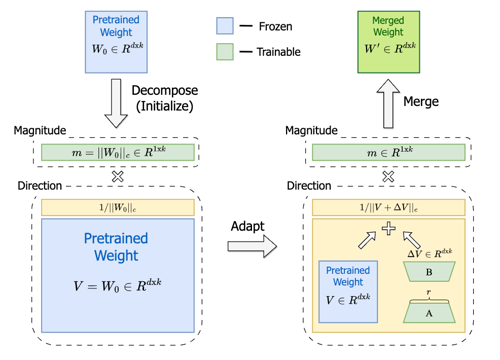
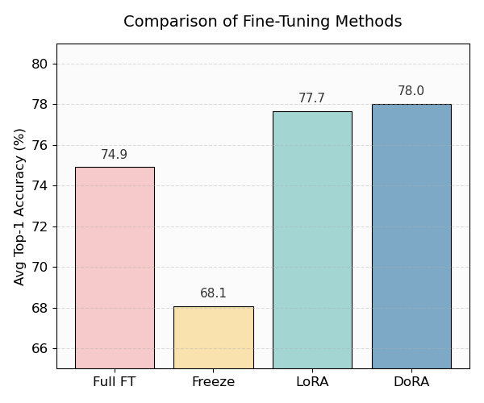
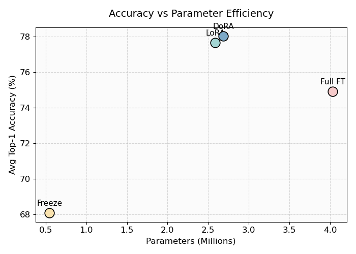

  

# GSoC 2025 Work Product

This repository contains *the final report for Google Summer of Code 2025.*

**Project**: Improve OTX Classification via DoRA and Transformer Backbone.

## Project Overview

**Project Summary:** At the time I applied for the project, OTX offered only two training options: Full Fine-Tuning and LoRA. The goal of this project is to go beyond that by providing users with a wider range of training options. To achieve this, it is essential to explore more efficient fine-tuning methods, identify model architectures that support these methods, and provide experimental results that demonstrate their effectiveness.

**Expected Outcomes:** The core of this project is not only to implement new features and models, but also to provide experimental results across various datasets so that OTX users can choose the most suitable training method for their needs. As mentioned earlier, PEFT methods often outperform Full Fine-Tuning (FFT), but the reduced number of trainable parameters inevitably leads to a trade-off with model performance (accuracy). Therefore, it is essential to conduct experiments on diverse types of datasets, measuring not only accuracy but also computational cost (such as GPU memory usage and training time) in order to clearly show users the degree of trade-off involved.

## Implementation Details

This implementation is based on the following papers:

- [LoRA: Low-Rank Adaptation of Large Language Models](https://arxiv.org/abs/2106.09685)
- [DoRA: Weight-Decomposed Low-Rank Adaptation](https://arxiv.org/abs/2402.09353)

DoRA is designed to decompose weights into magnitude and direction.

  

The overall process consists of three main stages: **1. Decompose**, **2. Adapt**, and **3. Merge**.

[The core part](https://github.com/gyuilLim/GSoC_2025/blob/main/PEFT/peft.py#L95-L116) of this implementation directly follows the formulation in the DoRA paper (*Weight-Decomposed Low-Rank Adaptation*, arXiv:2402.09353).

Each step in the code is aligned with the corresponding equations in the paper, and the comments explicitly indicate which equation is being implemented.

## Experimental Results

### 0. Experimental Setup

All experiments followed the default OTX training configurations.

We used **DINOv2-small** as the backbone model.

### 1. Average Accuracy across 7 Datasets
We compared four different fine-tuning strategies (**Full FT, Freeze Backbone, LoRA, DoRA**) on 7 datasets:
`FGVC-Aircraft, Food-101, Stanford Cars, CUB-200, HAM10000, RESISC45, and Kitti Distance`.

The average accuracy results are summarized in the bar chart below:

  

---

### 2. GPU Memory Consumption
We also measured *GPU memory usage*

The GPU memory comparison is illustrated in the following chart:

  

## Conclusion

As mentioned earlier, the main goal of this project is to provide a broader range of fine-tuning options for users. These results can serve as a valuable reference for selecting the most suitable fine-tuning strategy depending on the user's goals - whether it's minimizing resource usage or maximizing performance.

For more information, please refer to the post [here]().

## List of Pull Requests

1. [Support linear classifier fine-tuning for classification models](https://github.com/open-edge-platform/training_extensions/pull/4298)
2. [Improve dinov2 accuracy in classification tasks](https://github.com/open-edge-platform/training_extensions/pull/4411)
3. [Add DoRA support for ViT classification model](https://github.com/open-edge-platform/training_extensions/pull/4466)
4. [Enable PEFT support for h-label & multi-label classification](https://github.com/open-edge-platform/training_extensions/pull/4509)
5. [Add documentation for PEFT (LoRA & DoRA)](https://github.com/open-edge-platform/training_extensions/pull/4596)